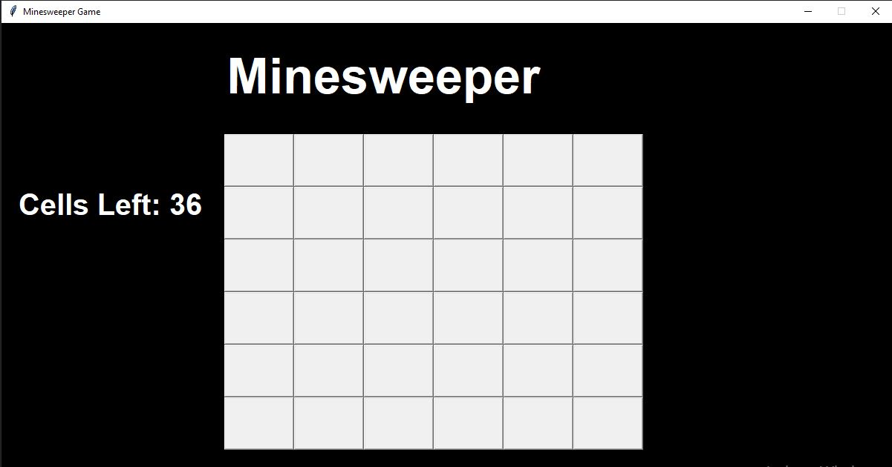
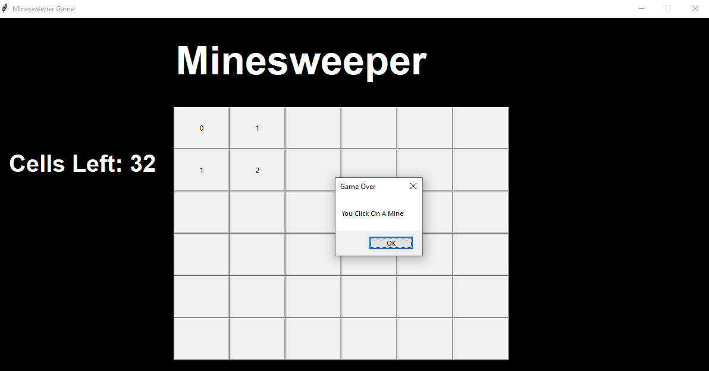
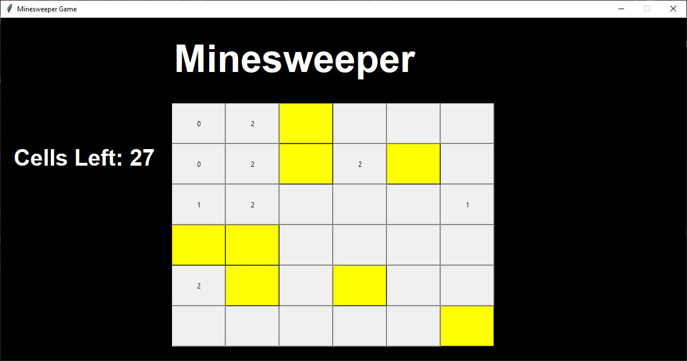

# Python Minesweeper Game

This is a simple minesweeper game written in Python. It uses the tkinter library to display the game board and handle user input. We used simple python classes to represent the game board and the game state.

 

## Python Modules Used:
- tkinter
- random
- ctypes
- sys

 

## Output:

 

## Note:
- The game board is generated randomly. The number of mines is set to 10% of the total number of cells.
- Left click to reveal a cell.
- Right click to flag a cell. (Yellow Color)